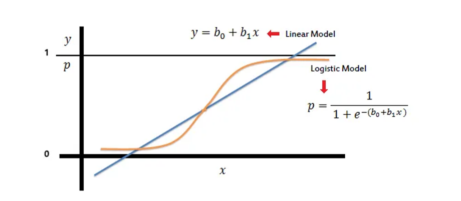

# Natural Language Processing with Disaster Tweets

  

## 1. Project introduction

#### With the rapid development of digital technology today, each online user increasingly (ngay cang) has more opportunities to access and leverage valuable data more easily than over before..This opens the door for the development of various (da dang) applications, from market trend analysis to gaining deep insights into the moods and behaviors of groups of people on social mediall.Therefore, i choose Twitter as the source of data.

#### Why choose Twitter over other platforms ?

#### The decision to choose Twitter as the main data source is due to its rapid growth and  vast, real-time data reflecting (phan anh) global events.With over 6,000 tweets per second, Twitter provides a massive flow of information, making it an ideal (ly tuong) platform for quick updates on ongoing events. 

## 2. NLP ?

#### NLP or Natural Language Processing , refers to a set of techniques designed to help machines learn form text.Natural Language Processing supports everything from chatbot to search engines and is used in various tasks such as sentiment analysis and machine translation.

## 3. Logistic Regression

  

 F1 is calcuated follows:
>
- $\text{precision} = \frac{TP}{TP + FP}$
- $\text{recall} = \frac{TP}{TP + FN}$

> Confusion matrix

|    | 0   | 1        |
| -------- | -------- | -------- |
| 0  | 4085  | 257    |
| 1  | 466   | 2805   |

#### The confusion matrix evaluates (danh gia) the performance of a classification model.Specifically, here we have a logistic model predicting a binary variable (0 or 1)
- True Positives (TP): 4085 samples predicted as 0 and are actually 0.
- False Positives (FP): 257 samples predicted as 0 but are actually 1.
- False Negatives (FN): 466 samples predicted as 1 but are actually 0.
- True Negatives (TN): 2805 samples predicted as 1 and are actually 1.

#### From these numbers, we can calculate important metrics:

- $\text{Accuracy} = \frac{TP + TN}{TP + TN + FP + FN}$
  
- $\text{Accuracy} = \frac{4085 + 2805}{4085 + 2805 + 257 + 466} = 0.9050$

- $\text{Recall/Sensitivity} = \frac{TP}{TP + TN }$
  
- $\text{Specificity} = \frac{TN}{TN + TP }$

- $\text{F1-score} = 2*\frac{Precision * Recall}{Precision + Recall} =0.8858$

  
